# 🔄 Microsoft OAuth Flow Diagram - Người Học vs Admin

## 🎯 NGƯỜI HỌC (USER) FLOW

```mermaid
sequenceDiagram
    participant U as User Browser
    participant UL as User Login Page<br/>(/login)
    participant MS as Microsoft OAuth
    participant CB as Callback Handler<br/>(/user/auth/callback)
    participant API as Backend API
    participant RX as Redux Store
    participant UP as User Protected Pages

    Note over U, UP: 🟦 USER AUTHENTICATION FLOW

    U->>UL: 1. Click "Đăng nhập với Microsoft"
    UL->>UL: 2. Generate random state token
    UL->>UL: 3. Store state in cookie (10 min)
    UL->>API: 4. GET /user/auth/get-uri-microsoft
    API-->>UL: 5. Return Microsoft auth URL
    UL->>MS: 6. Redirect to Microsoft OAuth

    Note over MS: User authenticates with Microsoft

    MS->>CB: 7. Redirect with code & state
    CB->>CB: 8. Verify CSRF state from cookie
    CB->>API: 9. POST /user/auth/callback {code}
    API-->>CB: 10. Return JWT token
    CB->>CB: 11. Store token & role="user" in cookies
    CB->>API: 12. GET /user/get-profile (with token)
    API-->>CB: 13. Return user profile data
    CB->>RX: 14. dispatch(setUserProfile(data))
    CB->>UP: 15. navigate("/dashboard")

    Note over UP: User can now access protected routes
```



## 🛡️ ADMIN FLOW

```mermaid
sequenceDiagram
    participant A as Admin Browser
    participant AL as Admin Login Page<br/>(/admin/login)
    participant MS as Microsoft OAuth
    participant CB as Callback Handler<br/>(/admin/auth/callback)
    participant API as Backend API
    participant RX as Redux Store
    participant AP as Admin Protected Pages

    Note over A, AP: 🟨 ADMIN AUTHENTICATION FLOW

    A->>AL: 1. Click "Đăng nhập với Microsoft"
    AL->>AL: 2. Generate random state token
    AL->>AL: 3. Store state in cookie (10 min)
    AL->>API: 4. GET /admin/auth/get-uri-microsoft
    API-->>AL: 5. Return Microsoft auth URL
    AL->>MS: 6. Redirect to Microsoft OAuth

    Note over MS: Admin authenticates with Microsoft

    MS->>CB: 7. Redirect with code & state
    CB->>CB: 8. Verify CSRF state from cookie
    CB->>API: 9. POST /admin/auth/callback {code}
    API-->>CB: 10. Return JWT token
    CB->>CB: 11. Store token & role="admin" in cookies
    CB->>API: 12. GET /admin/get-profile (with token)
    API-->>CB: 13. Return admin profile data
    CB->>RX: 14. dispatch(setAdminProfile(data))
    CB->>AP: 15. navigate("/admin/dashboard")

    Note over AP: Admin can now access protected routes
```



## 🔐 Route Protection Comparison

### 👤 USER ROUTE PROTECTION


### 🛡️ ADMIN ROUTE PROTECTION

```mermaid
flowchart TD
    A[Admin accesses protected route] --> B{Check Cookie<br/>token exists}
    B -->|false| C[Redirect to /admin/login]
    B -->|true| D{Check Cookie<br/>role = "admin"}
    D -->|true| E[Allow access]
    D -->|false| C

    style A fill:#fff3e0
    style E fill:#c8e6c9
    style C fill:#ffcdd2
```

## 📊 State Management Comparison

### 🟦 USER STATE (Redux)

```javascript
// userSlice.js
state = {
  userProfile: {
    userId: "user123",
    email: "user@example.com",
    fullName: "Nguyễn Văn A",
    roleId: "TUTOR", // USER | TUTOR
    roles: [{ name: "USER" }, { name: "TUTOR" }],
  },
  isAuthenticated: true,
  profileLoading: false,
  profileError: null,
};
```

### 🟨 ADMIN STATE (Redux + Cookies)

```javascript
// adminSlice.js
state = {
  adminProfile: {
    adminId: "admin123",
    email: "admin@example.com",
    fullName: "Quản Trị Viên",
    role: "ADMIN",
  },
};

// Cookies
token = "jwt_token_here";
role = "admin";
```

## 🛠️ Technical Differences

| Aspect               | 👤 USER                        | 🛡️ ADMIN                        |
| -------------------- | ------------------------------ | ------------------------------- |
| **Login Page**       | `/login`                       | `/admin/login`                  |
| **Callback Route**   | `/user/auth/callback`          | `/admin/auth/callback`          |
| **Auth API**         | `/user/auth/get-uri-microsoft` | `/admin/auth/get-uri-microsoft` |
| **Callback API**     | `/user/auth/callback`          | `/admin/auth/callback`          |
| **Profile API**      | `/user/get-profile`            | `/admin/get-profile`            |
| **State Management** | Redux (complex)                | Redux + Cookies (simple)        |
| **Route Protection** | ProtectRoute.jsx               | AdminPrivateRoutes.jsx          |
| **Auth Check**       | Redux isAuthenticated          | Cookie token + role             |
| **Redirect Success** | `/dashboard`                   | `/admin/dashboard`              |
| **Redirect Fail**    | `/login`                       | `/admin/login`                  |

## 🔄 Error Handling

### Common Error Scenarios:

1. **CSRF State Mismatch**

   ```
   User → Login → Microsoft → Callback
                              ↓
                    ❌ State cookie expired/missing
                              ↓
                    Redirect to login with error
   ```

2. **API Authentication Failure**

   ```
   Callback → Exchange code for token
             ↓
   ❌ Backend API error
             ↓
   Show error + redirect to login
   ```

3. **Profile Loading Failure**
   ```
   Token received → Fetch profile
                   ↓
   ❌ Profile API error
                   ↓
   Still redirect to dashboard with warning
   ```

## 🔍 Debug Points

### Key Console Messages:

```javascript
// Initiation
"Redirecting to Microsoft for user/admin login:";

// Callback Processing
"Processing callback for role: user/admin";
"CSRF State verified successfully";

// API Responses
"Auth callback response:";
"Profile response:";

// Redux Updates
"User/Admin profile dispatched to Redux";

// Navigation
"Authentication successful. Navigating to /dashboard";
```

### Browser DevTools Inspection:

```javascript
// Check authentication state
console.log("Redux state:", window.store?.getState());
console.log("Cookies:", document.cookie);
console.log("Current user:", window.store?.getState().user);
console.log("Current admin:", window.store?.getState().admin);
```
