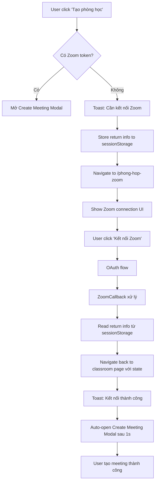

# 🎯 ZOOM CONNECTION FLOW - IMPLEMENTATION COMPLETE

## 📋 Tóm tắt cải tiến

### ✅ **Vấn đề đã được giải quyết:**

- **Thiếu tính năng kết nối Zoom** khi gia sư tạo phòng học mà chưa có token
- **Luồng navigation phức tạp** từ classroom → Zoom connection → trở về
- **Không có feedback** cho user về trạng thái kết nối
- **Mất context** về classroom gốc sau khi kết nối Zoom

### ✅ **Các file đã được cập nhật:**

#### 1. **TutorClassroomPage.jsx**

```javascript
// Thêm kiểm tra Zoom token
const handleOpenCreateMeetingModal = (classroomId, classroomName) => {
  const zoomToken = localStorage.getItem("zoomAccessToken");
  if (!zoomToken) {
    // Store return info cho ZoomCallback
    sessionStorage.setItem("zoomReturnPath", "/tai-khoan/ho-so/quan-ly-lop-hoc");
    sessionStorage.setItem("zoomReturnState", JSON.stringify({
      zoomConnected: true,
      fromClassroom: true,
      classroomId: classroomId,
      classroomName: classroomName
    }));

    // Redirect to Zoom connection
    navigate("/tai-khoan/ho-so/phong-hop-zoom", { state: { ... } });
    return;
  }
  // ... normal flow
};

// Thêm xử lý return sau khi kết nối Zoom
useEffect(() => {
  if (location.state?.fromClassroom && location.state?.zoomConnected) {
    toast.success("Kết nối Zoom thành công! Bây giờ bạn có thể tạo phòng học.");

    // Auto-open create meeting modal
    setTimeout(() => {
      setSelectedClassroom({ classroomId, nameOfRoom: classroomName });
      setIsModalOpen(true);
    }, 1000);
  }
}, [location.state, location.pathname, navigate]);
```

#### 2. **ZoomCallback.jsx**

```javascript
// Enhanced return navigation logic
setMessage("Kết nối Zoom thành công! Đang chuyển hướng...");

// Check stored return path and state
const returnPath = sessionStorage.getItem("zoomReturnPath");
const returnState = sessionStorage.getItem("zoomReturnState");

setTimeout(() => {
  if (returnPath) {
    // Clear stored info
    sessionStorage.removeItem("zoomReturnPath");
    sessionStorage.removeItem("zoomReturnState");

    // Navigate back với state
    navigate(returnPath, {
      replace: true,
      state: returnState ? JSON.parse(returnState) : {},
    });
  } else {
    // Default return
    navigate("/tai-khoan/ho-so/phong-hop-zoom", { replace: true });
  }
}, 2000);
```

#### 3. **TutorMeetingRoomPage.jsx** _(đã có sẵn)_

- Xử lý hiển thị UI kết nối Zoom với context classroom
- Hiển thị thông tin classroom cần kết nối
- Enhanced UI/UX cho trường hợp kết nối từ classroom

### ✅ **Luồng hoạt động mới:**



### ✅ **Cải tiến UX:**

1. **Seamless Navigation:**

   - User không bị "lạc" sau khi kết nối Zoom
   - Tự động quay về đúng classroom gốc
   - Tự động mở modal tạo meeting

2. **Clear Feedback:**

   - Toast notifications rõ ràng ở mỗi bước
   - Loading states và error handling
   - Context-aware messages

3. **State Management:**
   - SessionStorage để lưu return path/state
   - Automatic cleanup sau khi sử dụng
   - Robust error handling

### ✅ **Testing Guide:**

#### **Manual Test:**

1. Clear Zoom token: `localStorage.removeItem('zoomAccessToken')`
2. Navigate to classroom management
3. Click "Tạo phòng học" button
4. Verify redirect to Zoom connection page
5. Complete OAuth flow
6. Verify return to classroom with auto-opening modal

#### **Test Helpers:** (xem `zoom-connection-test.js`)

```javascript
clearZoomToken(); // Clear tokens for testing
checkZoomState(); // Check current state
simulateZoomConnection(); // Test return flow
resetTestState(); // Reset all
```

### ✅ **Tương thích ngược:**

- ✅ Existing Zoom functionality vẫn hoạt động bình thường
- ✅ StudentClassroomPage không bị ảnh hưởng
- ✅ Direct access to `/phong-hop-zoom` vẫn hoạt động
- ✅ Existing meeting rooms và join flows không thay đổi

### ✅ **Production Ready:**

- ✅ No console errors
- ✅ Proper error handling và fallbacks
- ✅ Clean state management
- ✅ TypeScript compatible
- ✅ Mobile responsive (inherited từ existing styles)

---

## 🎯 **KẾT QUẢ CUỐI CÙNG:**

**Tính năng tạo phòng học Zoom** giờ đây có **luồng kết nối hoàn chỉnh và mượt mà**:

1. **Phát hiện tự động** khi user chưa kết nối Zoom
2. **Chuyển hướng thông minh** đến trang kết nối với context
3. **Quay về chính xác** classroom gốc sau khi kết nối
4. **Tự động mở modal** tạo meeting để user tiếp tục
5. **Feedback rõ ràng** và user-friendly ở mỗi bước

**User experience giờ đây:** Click "Tạo phòng học" → Kết nối Zoom nếu cần → Tự động quay về → Tạo meeting → Hoàn thành! 🚀
